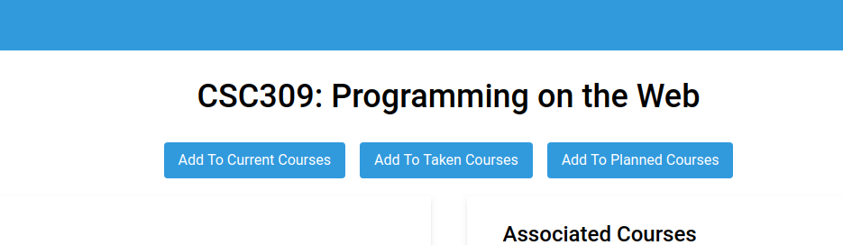

<p align="center">

<br/>
<br/>
<strong>Portal</strong> is a website that compiles every piece of information about a course. From course descriptions to syllabi and professors to forum/reddit conversations about them. We utilize and gather information from go-to sites that students often refer to when they start their research, such as the <a href="https://fas.calendar.utoronto.ca/">course calendar</a>, <a href="https://www.reddit.com/r/uoft">Reddit</a>, and course websites, and syndicate this information in a way that is <strong>digestible</strong> and <strong>easy to access</strong>.
</p>

- [DEPLOYED LINK](#deployed-link)
- [Getting Started](#getting-started)
- [Contributing](#contributing)
- [TA Instructions](#ta-instructions)
  - [Anonymous User Interactions](#anonymous-user-interactions)
    - [Search](#search)
    - [Course Details](#course-details)
  - [Student User Interactions](#student-user-interactions)
    - [Login](#login)
    - [Save Courses](#save-courses)
    - [Submit Course Resources](#submit-course-resources)
    - [Add Comments](#add-comments)
    - [Profile](#profile)
  - [Admin User Interactions](#admin-user-interactions)
    - [Remove Course Content](#remove-course-content)
    - [Admin Page](#admin-page)
- [Login Credentials](#login-credentials)
- [Motivation](#motivation)
- [Resources](#resources)

## DEPLOYED LINK

https://portal-course.herokuapp.com/

## Getting Started

Navigate to the [Deployed link](#deployed-link) to view the running app.
Build the application with a static frontend using npm run build in the /team51 directory

## Contributing

See our [Contributing Guide](docs/CONTRIBUTING.md) for more information on how to help as well as API routes and information.
[EXPRESS ROUTES](https://github.com/csc309-fall-2019/team51/blob/master/docs/CONTRIBUTING.md#express-routes)

## TA Instructions

Start by following the instructions in the [Getting Started](#getting-started) section above to install dependencies and run the application development server. When you load up the app in your browser, you should see the application Home screen. Right now, you are an **anonymous user** in our system.

### Anonymous User Interactions

#### Search

As an anonymous user, you have the ability to search for courses on the home screen. Try searching for the course code `CSC309` in the search bar:


You can click on one of the suggested results to be taken directly to the course details page, or you can hit `Enter` on your keyboard to see more search results on the search page.

If you go back to the home page, you'll also see some results for Top Rated Courses, as well as some quick links to search for courses by Department or Breadth Requirement:


Clicking on one of these quick links will take you to the search page with the search query pre-filled.

#### Course Details

Anonymous users also have the ability to view course details. If you navigate to a course page like [/course/CSC309H1](https://portal-course.herokuapp.com/course/CSC309H1), you will see various information about a course:

- Description
- Recommended Preparation
- Prerequisites/Exclusions
- Related Reddit threads
- Course Resources (links to course websites and syllabi)
- User comments

**NOTE:** As an anonymous user, you don't have permissions to save courses to your profile, leave comments, or submit updates to the course information.

### Student User Interactions

A student user is our standard user type and it can do all the things that an anonymous user can do as well as the following:

#### Login

To login as a student user, navigate to the Login page by clicking the button in the top right corner. You can use one of the student user credentials listed in the [Login Credentials](#login-credentials) section below.

If your credentials are invalid, you will see an alert. On the login page, you can also reset your password by clicking the `Forgot Password?` link. You can also create an account if you don't already have one by clicking on the `Create Account` link.

#### Save Courses

Once you are logged in as a student, navigate to a course page like [/course/CSC309H1](https://portal-course.herokuapp.com/course/CSC309H1). On this page, you'll now see buttons to save the course to your profile:



#### Submit Course Resources

In the `Course Resources` section of the course details page, you will now see that you can submit courses resources for approval. Clicking on the button will open a form where you can share a link to a course resource:


**NOTE:** Resources need to approved by an admin for them to show up on the course details page for other users.


#### Add Comments

As a student, you also have the ability to add your own comments on a course on the course details page. You can provide a rating between 1 and 5, as well as some text comments:


#### Profile

As a logged-in user, you also have your own Profile page. You can access this page by clicking on your avatar in the top right corner and selecting the Profile menu link from the dropdown.

On the Profile page, you can see your user details as well as your Current, Taken, and Future courses.

### Admin User Interactions

An admin user is a special user type that has all the capailities of anonymous and student users, but also has additional permissions such as adding/modifying courses, removing students, and approving/rejecting course resource submissions.

You can login as an admin, using the [admin credentials below](#login-credentials).

#### Remove Course Content

As an admin, on any course page, you have the ability to delete Reddit threads, course resources, and comments by clicking the red `Remove *` button next to each item:


#### Admin Page

Admin users also have access to an Admin page. You can access this page by cliking on your avatar in the top right corner and clicking on the `Admin` menu item in the dropdown.

On the admin page, you can see how many courses and users there are in the app. You can also add new courses, review/remove users, and approve/reject course resource submissions:


## Login Credentials

<details>
 <summary>Admin</summary>
 <p>

```
Username: admin
Pass: admin
```

</details>

<details>
 <summary>Student</summary>
 <p>
  
```
Username: user
Pass: user
```

  </p>
</details>

<details>
 <summary>Student 2</summary>
 <p>

```
Username: user2
Pass: user2
```

  </p>
</details>

## Motivation

Students at UofT today have to do a lot of research themselves on multiple sites and sources to really understand what a course is about before enrolment. Often the course info provided by the departments are insufficient or, at times, misrepresents what the course is really about. There is no central portal to aid with course selection!

As students ourselves, we believe that a site like Portal would massively change the game of choosing courses. Through our website, students will be **more informed** about their course selection and make sure that their **time and money are spent well** during their post-secondary journey.

## Resources

- [Project Proposal](https://docs.google.com/document/d/1v7ISPD15b0lTbYbttDvvka7RXBrwPtEX82-_Glzvj3E/edit)
- [High-fidelity Mockups](https://www.figma.com/file/Y44QUUYGFdbpySf7wmUh9Q/Course-Portal?node-id=2988%3A540)
- [Create React App](https://github.com/facebook/create-react-app)
